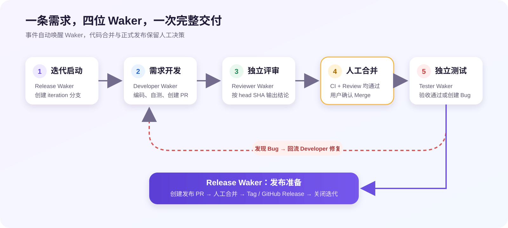

# QoderWake × GitHub DevOps Demo

本仓库用于演示一条容易观察、可重复运行的 AI DevOps 研发闭环。

下面通过一个 Demo 给大家演示，如何借助 QoderWake + GitHub 完成一次从需求创建、代码开发、评审测试到版本发布的完整交付。

推荐先阅读：[QoderWake × GitHub AI DevOps 最佳实践](docs/demo-flow-guide.md)。文档包含完整研发流程、SVG 方案架构图、角色分工、工程原则和一键体验方式。

## 推荐演示链路

1. `Start QoderWake Demo` 创建 Milestone 和 `flow:demo` Requirement。
2. Release Waker 创建 `iteration/*`，并将 Requirement 置为 `status:ready-dev`。
3. Developer Waker 推荐在 `demo/feature/*` 或 `demo/bugfix/*` 开发、测试并创建 PR；Router 以 PR 中的 `Flow: demo` 与 `[QW-DEMO][DEV][READY]` 作为权威交付标记。
4. PR 创建或代码 revision 更新触发 Reviewer Waker；评论、Review 和普通状态变化不会触发。
5. Reviewer 写入 `[QW-REVIEW][sha][PASS]` 后，由用户人工合并代码 PR。
6. 合并触发 Tester Waker。`fail-once` 路径会创建一次 Bug 并完成修复、复评审、复测；`pass` 路径直接通过。
7. 测试通过后 `Publish Demo Iteration` 唤醒 Release Waker创建发布 PR。
8. 用户合并发布 PR 后，Release Waker 打 Tag、创建 GitHub Release 并关闭 Milestone。

## 自动化边界

- GitHub Issue、Milestone、PR、CI 和 Release 是研发事实源。
- `demo-router.yml` 只转发 `flow:demo` Issue 与带权威交付标记的代码 PR。
- 四个 Waker 使用相互独立的 API 自动任务和 `QW_DEMO_*_WEBHOOK` Secret。
- `ci.yml` 只负责代码质量门禁；代码合并与正式发布合并由用户确认。

Qoder PAT 和 Waker API 地址只保存在 GitHub Actions Secrets。每次调用都在 Header 中携带 `Authorization: Bearer <PAT>`。

## Demo 下载

后续演示统一基于开源仓库 [blue199288/order-coupon-devops-demo](https://github.com/blue199288/order-coupon-devops-demo) 进行。启动器源码包请从 [QoderWake × GitHub Demo v3.1.3](https://github.com/blue199288/order-coupon-devops-demo/releases/tag/qw-github-demo-v3.1.3) 下载：

- [Windows 源码包](https://github.com/blue199288/order-coupon-devops-demo/releases/download/qw-github-demo-v3.1.3/QoderWake-GitHub-Demo-3.1.3-Windows-Source.zip)
- [macOS / Linux 源码包](https://github.com/blue199288/order-coupon-devops-demo/releases/download/qw-github-demo-v3.1.3/QoderWake-GitHub-Demo-3.1.3-macOS-Linux-Source.zip)

当前不再提供二进制安装包。macOS、Windows 与 Linux 均直接运行源码，不需要编译，也不需要执行 `npm install`。macOS/Linux 解压源码包后运行 `./start-demo`；Windows 解压后运行 `start-demo.cmd`。运行前请安装 Node.js 20+、Git、GitHub CLI 和 Global QoderWake。PAT 会在首次运行时隐藏输入，不包含在仓库或下载包中。

选择的本地目录不存在时，启动器会先创建目录并自动 clone；配置中的本地 checkout 被删除后重新运行，也会从远端自动恢复。远端仓库不存在或当前账号无权限时，程序会停止并显示可操作的错误信息，不会继续创建 Waker Project。
