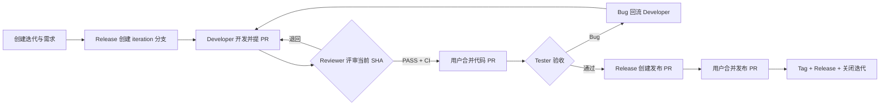
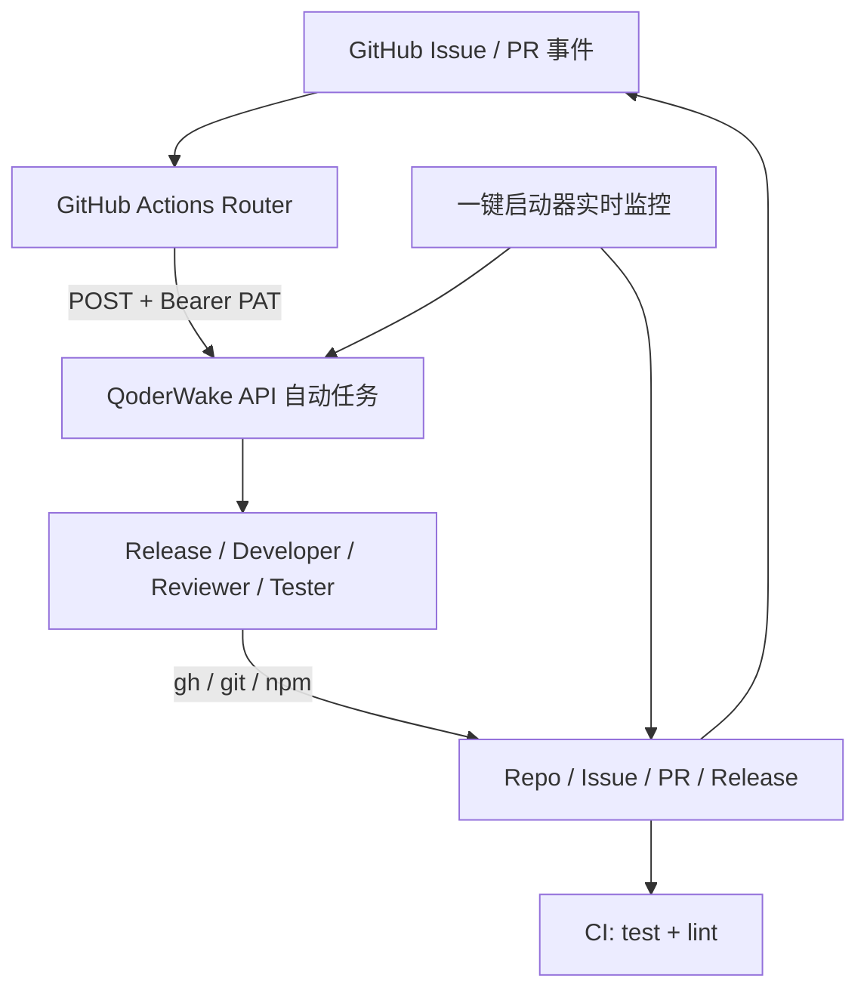

# Demo 流程演示说明

## 流程

## 架构

- GitHub 保存迭代、需求、Bug、PR、CI 和人工门禁事实。
- Actions 过滤事件、读取 GitHub Secrets、组装上下文并调用指定 Waker。
- QoderWake API 自动任务使用 `Authorization: Bearer <PAT>` 接收调用并创建隔离任务。
- Waker BIBLE 限定每个角色能做什么、何时 NOOP、哪些动作必须留给用户。
- Demo 与 Real 流程通过 `flow:demo` / `flow:real`、独立 Webhook Secret 和分支规则隔离。

## 演示操作

1. 在一键向导选择“Demo 流程”。
2. 输入新的迭代名和需求；首次建议选择“首轮发现一个 Bug”。
3. 开启实时监控。Waker 执行时终端会给出会话链接。
4. 出现“等待人工合并代码”后，确认 Reviewer 有 `[QW-REVIEW][sha][PASS]` 且 CI 绿色，点击 Merge。
5. Tester 会自动验收。Bug 路径会自动创建工作项，并完成开发、复评审和复测闭环。
6. 验收通过后工具自动触发发布；出现“等待人工发布”后合并发布 PR。
7. Release Waker 打 Tag、创建 GitHub Release、关闭 Milestone，终端显示 9/9 完成。

中断监控后可运行 `npm run watch` 恢复。PAT 与 Waker API 地址只存储在 GitHub Actions Secrets 中，不会写入仓库或终端日志。
