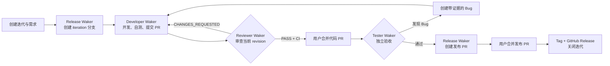
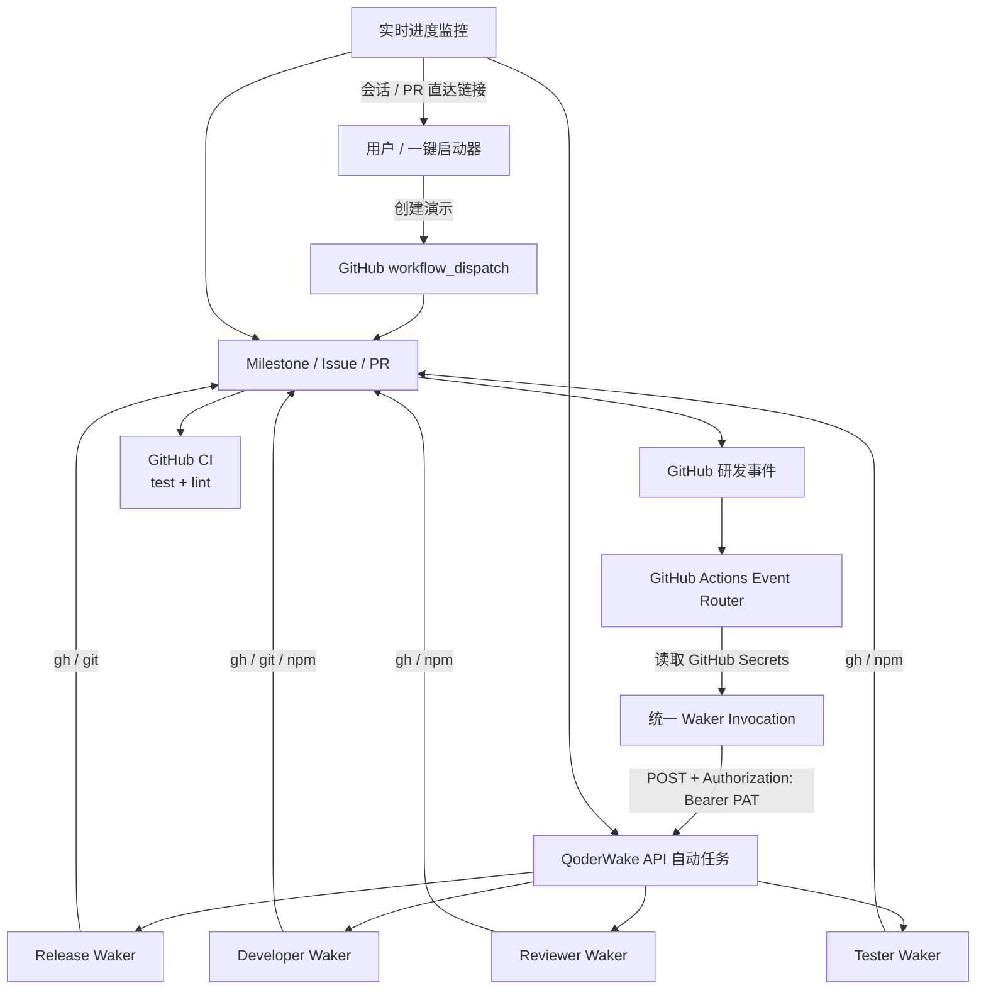

# 让每一次研发事件，都能找到最合适的 AI 同事

## QoderWake × GitHub：从“人盯流程”到“事件驱动的智能研发协作”

需求已经进入迭代，谁来开始开发？代码刚刚更新，谁来重新 Review？测试发现问题，如何把完整证据送回开发，并确保修复后再次评审和复测？版本具备发布条件后，谁来准备发布记录、Tag 和 Release？

在传统研发流程中，这些动作往往依赖项目经理提醒、开发者主动查看、群消息通知和人工复制上下文。工具虽然很多，真正推动流程前进的仍然是人。

QoderWake 提供了另一种工作方式：把不同职责交给长期在线、边界清晰的 Waker，让 GitHub 中真实发生的研发事件自动唤醒对应角色。每个 Waker 都能重新读取当前事实、执行专业任务、留下可审计结果，并把流程交给下一个角色。

> **一句话方案：GitHub 负责记录事实和质量门禁，QoderWake 负责理解事件并完成工作，人只保留关键决策。**

这套最佳实践已经封装为一键式 Demo。用户不需要手工创建 Waker、复制 Webhook 或编排脚本，完成一次引导配置后，即可持续创建新的迭代和需求，体验完整的 AI DevOps 闭环。

---

## 为什么研发团队需要“可被事件唤醒的 AI”

AI 编程助手解决了“如何更快写代码”，但完整研发过程还有三个更难的问题。

### 1. AI 知道能力，却不知道什么时候该工作

需求进入迭代、PR 更新、CI 完成、代码合并、测试失败，这些时机都存在于 DevOps 系统中。没有事件连接，AI 只能等待用户打开窗口、复制链接、解释背景并手工发起任务。

### 2. 一个万能 Agent 很容易越权

让同一个 Agent 同时开发、评审、测试和发布，看起来简单，却失去了职责分离：开发者可能自评自合，测试结论可能缺乏独立证据，发布动作也可能绕过人工门禁。

### 3. 自动化不等于可信任

只把 Webhook 接到大模型并不足以成为工程方案。研发自动化还需要幂等、防重复、最小权限、状态可见、失败可恢复，以及明确的人机边界。

QoderWake 的价值不只是“再增加一个 AI 入口”，而是让 AI 成为 DevOps 流程中可治理、可观察、可协作的执行角色。

---

## 一条需求，四位 Waker，一次完整交付

Demo 选择了客户最容易理解的一条研发主线，并刻意保留了两个人工 Merge 门禁。



### Release Waker：让迭代有清晰的交付边界

创建迭代后，Release Waker 从 `main` 创建独立的 `iteration/*` 分支，并把需求推进到可开发状态。测试通过后，它汇总需求、Bug、PR 和 CI 证据，创建发布 PR。用户合并后，它再创建 Tag、GitHub Release 并关闭 Milestone。

它不会写业务代码，也不会替用户合并。

### Developer Waker：从需求事实出发完成工程交付

Developer Waker 被“需求进入待开发”或“Bug 回流”事件唤醒。它重新读取需求、验收标准、评论和现有 PR，从 iteration 分支创建 `demo/feature/*` 或 `demo/bugfix/*`，补充测试、完成最小实现，并运行 `npm test` 与 `npm run lint`。

开发完成后，它创建或更新代码 PR，把测试证据、关联 Issue 和交付 marker 一起写入 PR，而不是只在对话窗口里声称“已经完成”。

### Reviewer Waker：只对确定的代码 revision 负责

Reviewer 只监听 PR 创建和源分支产生新提交两类内容事件。评论、标签、Review 状态变化不会让它重复工作。

它以 head SHA 为评审单位，读取完整 diff、关联需求和 CI，在独立工作区执行测试。存在阻断问题时写入 `CHANGES_REQUESTED` 并把工作交还 Developer；通过时留下 `[QW-REVIEW][sha][PASS]`，等待用户合并。

### Tester Waker：让缺陷真正回到研发链路

代码合入 iteration 分支后，Tester 才开始独立验收。测试失败不是发送一句聊天消息，而是创建包含复现步骤、期望、实际、日志和父需求的 Bug，并自动进入同一条 Developer → Reviewer → Merge → Tester 链路。

复测通过后，Bug 和 Requirement 才会进入验证完成状态，触发发布准备。

---

## 方案架构：让 DevOps 系统做控制面，让 Waker 做执行面



### GitHub：唯一研发事实源

Milestone 表示迭代，Issue 表示 Requirement 或 Bug，PR 表示代码与发布变更，CI 表示独立质量证据。Waker 每次被唤醒都重新读取这些事实，不沿用上一次会话中的旧结论。

这意味着用户可以继续在熟悉的 GitHub 页面查看状态、参与 Review、设置保护规则，不需要迁移到一套 AI 专属流程系统。

### GitHub Actions：轻量、透明的事件路由器

Actions 不负责“思考”，只负责四件事：监听事件、过滤噪声、准备最小上下文、把事件安全转发给指定 Waker。

选择 Actions 作为转发层还有一个重要原因：QoderWake API 调用必须在 Header 中携带 PAT。Actions 可以从加密 Secret 中读取 PAT 和 Waker API 地址，统一增加 `Authorization: Bearer <PAT>`，避免把凭据放在仓库、Webhook URL、请求正文或 Waker 提示词中。

### QoderWake API 自动任务：把一次事件变成一次受控执行

每个角色都配置一个 API 触发的自动任务。Router 提交的 payload 包含 `flow`、`role`、`eventType`、`repository`、业务对象和幂等标识。任务以 isolated 模式运行，既不污染其他事件的上下文，又能通过 GitHub 中的 marker 延续业务状态。

### Waker BIBLE：把角色职责写成长期有效的组织规则

BIBLE 不是一次性的 Prompt，而是角色持续遵守的工作章程。它明确：

- 这个 Waker 在什么事件下才可以进入；
- 每次执行必须重新读取哪些事实；
- 标准工作流和验收证据是什么；
- 哪些 marker 表示已经处理，何时必须 `NOOP`；
- 可以使用哪些工具和命令；
- 哪些动作永远禁止，例如自动 Merge、绕过 CI、打印 Secret。

因此，团队得到的不是四个临时对话，而是四个职责稳定、行为可治理的 AI 角色。

---

## 这套方案体现了哪些 QoderWake 最佳实践

### 最佳实践一：用事件触发工作，不用定时任务扫描世界

需求状态变化、PR revision 更新和代码合并都有明确事件。只有发生有效变化时才唤醒 Waker，既降低空转，也避免“扫描到一半事实又变化”的竞态。

### 最佳实践二：一个角色，一个责任边界

开发、评审、测试、发布使用独立 Waker、独立 BIBLE 和独立 API 自动任务。Developer 无权给自己 PASS，Reviewer 不修改代码，Tester 不伪造交付，Release 不替用户合并。

### 最佳实践三：AI 输出必须回写业务系统

代码、测试、评论、Bug、Tag 和 Release 都回写 GitHub。聊天记录用于观察执行过程，GitHub 才是下一个角色能够读取、用户能够审计的事实。

### 最佳实践四：机器执行与人工决策分层

Waker 可以自动完成分析、编码、测试和材料准备，但代码合并与正式发布仍由用户确认。AI 提升执行效率，人保留风险责任。

### 最佳实践五：技术幂等与业务幂等同时存在

调用层的 `wakeSessionUniqueId` 防止同一次投递重复执行；业务层以 head SHA、merge SHA 和 GitHub marker 判断工作是否已经完成。即使平台重试或重复事件到达，Waker 也会重新核验并安全 NOOP。

### 最佳实践六：凭据只存在于 Secret 边界

PAT 和 API 地址只存储在 GitHub Actions Secrets。启动器负责隐藏输入和加密写入，不读取已有值；Workflow 只在运行时注入；错误日志不会输出响应正文或凭据。

### 最佳实践七：从第一天开始考虑可观察性

启动器同时读取 GitHub 状态和 QoderWake Run，实时展示当前阶段、活动角色和下一项人工操作。Waker 开始工作时可跳转到实时会话，需要 Merge 时可直接打开对应 PR。流程不是在后台“黑盒运行”。

### 最佳实践八：演示流程与真实流程必须隔离

同一仓库同时支持简单 Demo 和客户 EATP 流程，但通过以下维度隔离：

| 隔离维度 | Demo 流程 | Real EATP 流程 |
|---|---|---|
| 事实标识 | `flow:demo` | `flow:real` |
| 角色 | Release / Developer / Reviewer / Tester | Orchestrator / Developer / Tester |
| Secret | `QW_DEMO_*_WEBHOOK` | `QW_REAL_*_WEBHOOK` |
| Router | `demo-router.yml` | `real-flow-router.yml` |
| 代码识别 | `demo/*` + Review SHA marker | Batch / `phase:*` / `eatp:L*` |

两套流程不共享 Waker 上下文，也不会因为同一个 Issue 或 PR 事件互相唤醒。

---

## 一键 Demo：客户实际会看到什么

运行：

```bash
./start-demo
```

向导会完成或复用以下配置：

1. GitHub Demo 仓库和 Actions 权限；
2. 四个 Demo Waker 及其 Project；
3. 四个 API 自动任务和调用地址；
4. `QODER_PAT` 与四个 Webhook Secrets；
5. Workflow、事件路由、CI 和状态 Label；
6. 本轮 Iteration、Requirement 和测试路径；
7. 实时进度监控。

首次演示建议选择“首轮发现一个 Bug”。这样客户能够看到最完整的一次接力：

```text
Requirement → 开发 → PR → AI Review → 人工 Merge
→ AI Test → Bug → 自动回流开发 → 再 Review → 再 Merge
→ 复测通过 → 发布 PR → 人工 Merge → Tag / Release
```

终端会在关键节点给出明确提示：

- Waker 正在运行：显示角色和实时会话链接；
- 等待代码合并：打开已通过 Reviewer 与 CI 的代码 PR；
- 等待发布：打开由 Release Waker 准备的发布 PR；
- 流程完成：显示版本已发布、Iteration 已关闭。

用户操作后无需回到终端点击“继续”，监控会通过新的 GitHub 事件自动进入下一阶段。中断后运行 `npm run watch` 即可恢复。

---

## 不止是 Demo：如何迁移到真实研发体系

这套实践不要求企业放弃现有 DevOps 平台。需要替换的只是“事件适配层”和“事实读取工具”：

| Demo 中的 GitHub | 企业系统中的对应能力 |
|---|---|
| Issue / Milestone | 需求、缺陷、迭代 |
| PR Event | GitLab MR、Codeup CR 等代码评审事件 |
| GitHub Actions Router | 云效 Flow、企业 CI 或事件总线 |
| `gh` CLI | 平台官方 CLI / OpenAPI |
| GitHub Secrets | CI 凭据库或企业密钥管理服务 |

Waker 的职责分工、BIBLE 约束、API 触发、幂等设计、人机门禁和可观察性可以原样复用。

仓库中保留的 Real EATP 流程就是进一步扩展的示例：它增加 Batch、INIT/DEV/TEST、错误分类、L0-L3 路由和 WAIT_USER，证明同一套 QoderWake 架构可以从“易理解的研发 Demo”演进为“复杂的企业测试状态机”。

---

## 一个最小配置示例

Router 只转发 Demo PR 的源码变更：

```yaml
pull_request:
  types: [opened, reopened, synchronize, ready_for_review, closed]

if: >-
  github.event.action != 'closed' &&
  github.event.pull_request.draft == false &&
  startsWith(github.event.pull_request.head.ref, 'demo/') &&
  startsWith(github.event.pull_request.base.ref, 'iteration/')
```

统一调用脚本在 Header 中安全注入 PAT：

```js
await fetch(apiUrl, {
  method: 'POST',
  headers: {
    Authorization: `Bearer ${qoderPat}`,
    'Content-Type': 'application/json',
  },
  body: JSON.stringify({
    flow: 'demo',
    role: 'reviewer',
    eventType: 'pull-request.content-revision',
    repository,
    context: { pullNumber, headSha },
  }),
});
```

真正重要的不是 YAML 有多少行，而是这条调用背后的工程约定：事件先过滤、凭据不落盘、角色有边界、执行可追踪、结果回写事实源、重复调用可安全退出。

---

## QoderWake 带来的改变

| 过去 | 使用 QoderWake 后 |
|---|---|
| 人工查看状态并通知下一个角色 | 状态事件自动唤醒对应 Waker |
| 每次重新解释需求和上下文 | Waker 从 DevOps 事实源读取最新上下文 |
| AI 生成结果停留在聊天窗口 | 代码、评论、Bug、测试证据和 Release 回写系统 |
| 一个 Agent 包办所有事情 | 多 Waker 职责分离、相互制衡 |
| 自动化过程难以观察 | 终端进度、实时会话、PR/Issue 证据全程可见 |
| 担心 AI 直接改动关键分支 | CI 与人工 Merge 作为不可绕过的门禁 |

QoderWake 不是替换研发团队，也不是替换 DevOps 平台。它把团队已经定义好的流程，转化为一组可以被事件自动唤醒、持续遵守规则、彼此协作的 AI 角色。

当需求、代码、测试和发布事件都能自动找到最合适的 Waker，研发人员就不再需要把时间花在催办、搬运上下文和重复检查上，而可以把注意力放回产品判断、技术决策和风险控制。

**这就是 QoderWake 作为 AI DevOps 执行层的最佳实践：让流程自己流动，让结果始终可见，让关键决策仍然掌握在人手中。**
